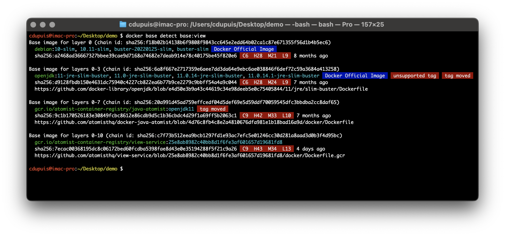

**Note:** This repository is not an officially supported Docker project.  

# `docker base` Docker CLI plugin

Docker CLI plugin to detect base images of local or remote container images.



The `docker base detect` command shows the following data about detected base images:

* Image name and tags
* Image digest
* Image vulnerabilities
* Age of image
* Link to the commit or Dockerfile from which the image was created
* `Docker Official Image`, `Verified Publisher` or `Sponsored OSS` - if the image is trusted content; either from Docker Official Images, Verified Publishers or Sponsored OSS
* `unsupported tag` - if the tag in use is not supported any longer (only for Docker Official Images)
* `tag moved` - if the tag in use has moved in the meantime; a new image was pushed using the same tag 

## Installation

To install, run the following command in your terminal:

```shell
$ curl -sSfL https://raw.githubusercontent.com/docker/base-cli-plugin/main/install.sh | sh -s --
```

Alternatively, you can install manually by following these steps:

* Download the plugin binary from the [release page](https://github.com/docker/base-cli-plugin/releases/latest)
* Unzip the archive
* Copy/move the binary into `$HOME/.docker/cli-plugins`

## Usage

### `docker base detect`

To detect base images for local or remote images, use the following command:

```shell
$ docker base detect <IMAGE>
```

`<IMAGE>` can either be a local image id or fully qualified image name from a remote registry.

### `docker base login`

To authenticate with the Atomist data plane, use the following command:

```shell
$ docker base login <WORKSPACE ID>
```

For the security reasons the command does not accept an API key as command parameter. Instead, an API key can be passed
in via stdin with the parameter `--api-key-stdin`.

The `login` command will also check the legacy `ATOMIST_API_KEY` environment variable.

Authentication is not required. If not authenticated, the plugin will only use public data from Docker Official Images,
Docker Verified Publishers or Docker-sponsored Open Source. Without authentication the `detect` command will not take
into account your own data on Docker Hub when searching for matching base images. 

Visit [dso.docker.com](https://dso.docker.com/r/auth/integrations) to obtain a `WORKSPACE ID` and `API KEY`.

### `docker base logout`

To remove the authentication to the Atomist data plane, use the following command:

```shell
$ docker base logout
```
